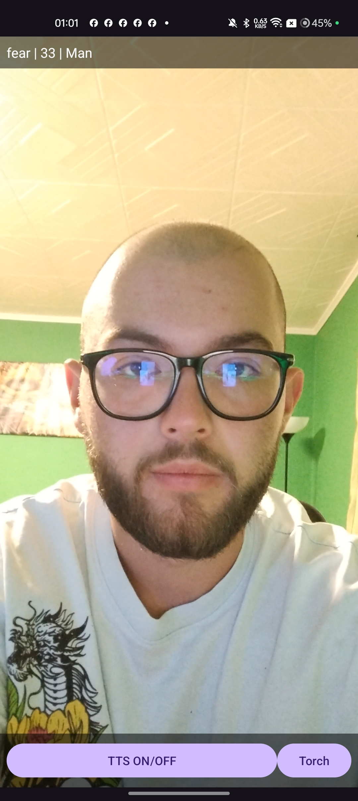

# VisionDemo — Real-Time Visual Recognition on Android

The main project of the internship. The app starts the phone camera and, on every frame, runs three
things in parallel: it finds the face, estimates emotion / age / gender, and counts the raised
fingers. The result is shown on screen and, optionally, read out loud.

> 🇷🇴 Documentul în limba română: [README.ro.md](README.ro.md)

<p align="center">
  
</p>

> The top bar shows the current result (`emotion | age | gender`), and the buttons at the bottom
> toggle speech output and the torch.
> Text-to-Speech demo clip: [`docs/media/visiondemo-tts-demo.mov`](../../docs/media/visiondemo-tts-demo.mov) *(Git LFS)*

---

## Features

| Feature | How it is implemented |
|---|---|
| Preview + frame-by-frame analysis | CameraX (`Preview` + `ImageAnalysis`, `KEEP_ONLY_LATEST` backpressure) |
| Face detection | ML Kit Face Detection — extracts the face ROI |
| Emotion / age / gender | 3 TensorFlow Lite models (DeepFace) run on the ROI |
| Finger counting | MediaPipe Hand Landmarker (21 landmarks × 2 hands) |
| Audio feedback | Android `TextToSpeech`, `ro-RO` locale with an `en-US` fallback |
| Torch | `CameraControl.enableTorch()` for low light |

## Code architecture

```
app/src/main/java/com/example/visiondemo/
├── MainActivity.kt        # permissions, CameraX, pipeline orchestration, UI, TTS
├── EmotionAgeGender.kt    # the Eag class — loads the 3 .tflite models and runs inference
├── Hands.kt               # the Hands class — HandLandmarker + finger counting logic
└── Extensions.kt          # helpers (ImageProxy → Bitmap, rotation correction, crop)

app/src/main/assets/       # the models (tracked with Git LFS)
├── emotion_deepface.tflite
├── age_deepface.tflite
├── gender_deepface.tflite
└── hand_landmarker.task
```

### Implementation details

**`Eag`** reads each model's input tensor shape at runtime
(`interp.getInputTensor(0).shape()`), so the same class works whether the model expects 48×48
grayscale (emotion) or 224×224 RGB (age/gender). Emotions are mapped to
`angry, disgust, fear, happy, sad, surprise, neutral`.

**`Hands`** runs the landmarker in `RunningMode.VIDEO` and decides whether a finger is extended from
the joint angles — a `55°` threshold for index/middle/ring/little and `50°` for the thumb. Because
the raw result flickered from frame to frame, every finger goes through a **majority vote over the
last 5 frames** (`historySize = 5`), which stabilised the count.

## Build & run

Requirements: Android Studio (Ladybug+), **JDK 17**, an Android phone with API ≥ 24.

```bash
git lfs install          # required, otherwise the models stay 130-byte pointers
git clone https://github.com/StefanHoria/Software-Engineering-Internship.git
```

Open `android/VisionDemo` in Android Studio, let Gradle sync, then Run. On first launch the app asks
for camera permission.

`compileSdk = 36`, `minSdk = 24`, `jvmTarget = 17`.

## Known limitations

- Accuracy drops noticeably in low light (hence the torch button).
- Age estimation is indicative only — the DeepFace models are trained on generic datasets.
- Finger counting needs the hand to face the camera reasonably straight on.
